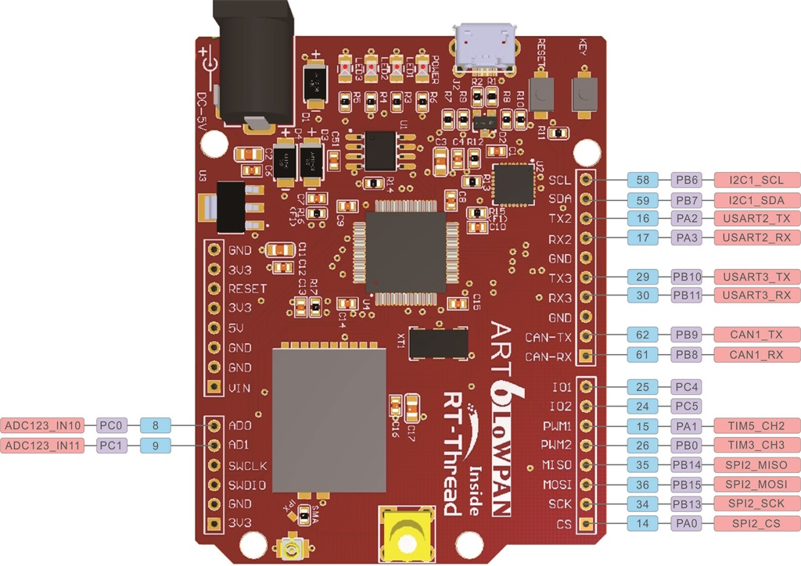
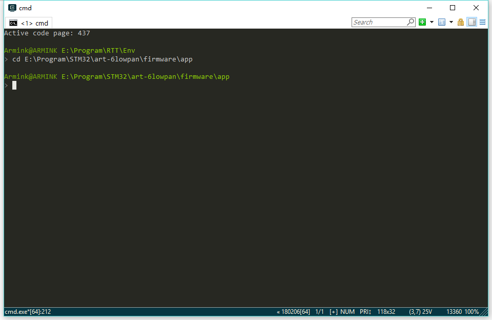
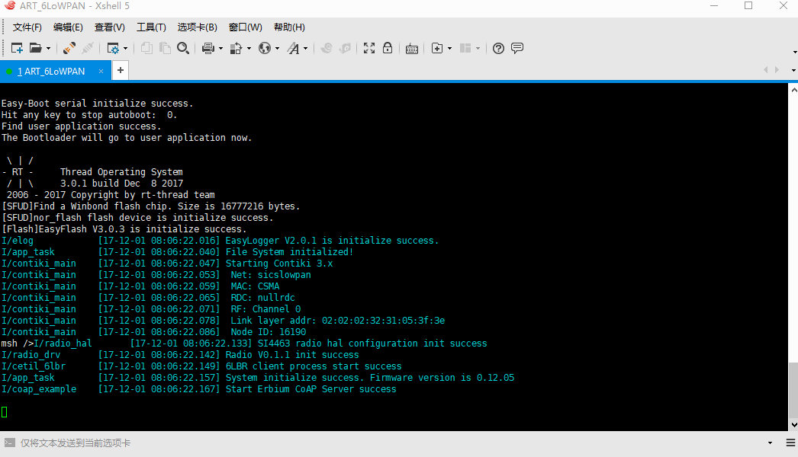

# ART-6LoWPAN 上手指南

---

## 1、认识硬件

[](https://github.com/ART-6LoWPAN/art-6lowpan)

### 1.1 外设接口

#### 1.1.1 电源及 USB

开发板可以通过 Micro-USB 或 **5V** 电源供电。使用 Micro-USB 接到电脑时，电脑上虚拟出一个串口。连接该串口后，可以通过 shell 命令行工具进行交互，也可以查看实时的日志信息。

> 温馨提示：如果需要让 STM32 的 USB 直接与电脑连接，可以将电阻 `R8` 与 `R9` 移除，在 `R10` 与 `R7` 位置焊接 0 欧姆电阻即可。

#### 1.1.2 按键

- RESET：硬件复位按键
- KEY：用户自定义按键（例如：在 `RAW_RADIO_TEST` 测试模式下，按下此按键将会自动发送射频数据）

#### 1.1.3 调试接口

STM32 的 SWD 的调试接口位于上图左下角，需要仿真调试时，将其与仿真器连接即可。

#### 1.1.4 通信接口

|接口|数量|备注|
|:-:|:-:|:-:|
|I2C|1路||
|USART|2路||
|CAN|1路||
|SPI|1路||

#### 1.1.5 其他接口

- AD 输入 2路
- 普通 IO 2路

### 1.2 指示灯

- POWER：电源指示灯
- LED1：用户自定义指示灯1，固件中作为系统运行指示灯使用
- LED2：用户自定义指示灯2，启用 `SI446X_TRANS_LED_ENABLE` 后，将作为射频数据 **接收** 指示灯
- LED3：用户自定义指示灯3，启用 `SI446X_TRANS_LED_ENABLE` 后，将作为射频数据 **发送** 指示灯

## 2、固件编译

### 2.1 Eclipse + GCC

详见《熟悉 Eclipse + GCC 开发环境》

### 2.2 Eclipse + IAR

将 `firmware/app/eclipse/iar` 下的 `.cproject` 拷贝、替换至 `firmware/app` ，其他编译下载方法与 Eclipse + GCC 一致。

### 2.3 IAR & Keil

#### 2.3.1 准备 RT-Thread 的 ENV 工具

**ENV** 是 RT-Thread 提供一个配置、构建其项目的工具，它的功能非常强大，深入了解请查看 [官方说明文档](https://www.rt-thread.org/document/site/zh/5chapters/01-chapter_env_manual/)，这里我们只引导大家完成 IDE 工程的生成。

[点击打开云盘地址](https://pan.baidu.com/s/1qX8R2nq#list/path=%2FART-6LoWPAN%2Ftools&parentPath=%2F) ，下载 `env_released_0.x.x.zip` ，然后解压出来

#### 2.3.2 生成 IAR/Keil 工程

点击 `env.exe` 或 env.bat （注意：某些杀毒软件可能误报，忽略或添加信任即可）。再进入到 ART-6LoWPAN 的固件源码根目录，如下图



> PS：如果 固件源码根目录 与 ENV 工具不在一个盘符下，记得提前使用 `D:` 类似命令，进入到 固件源码根目录 所在盘符。

如果，需要生成的工程为 IAR，此时需要先修改源码根目录下， `rtconfig.py` 文件顶部的，`EXEC_PATH` 对应的 IAR 的实际安装路径（Keil 也是同理），修改完成后保存。

此时在 ENV 工具中，根据自己实际的 IDE，选择下面两个命令中的一个进行输入，即可生成你想要的 IDE 工程。

```
scons --target=iar
scons --target=mdk5
```

生成后的工程文件名为 `project.*` ，位于 ENV 当前进入的目录下。双击打开后，即可执行固件编译。

## 3、固件下载

### 3.1 IAP 升级

如果开发板中已经存在 bootloader 或者 app ，那么可以通过 IAP 方式进行在线升级。

- 将开发板与电脑连接（确保已安装 CP210X 驱动，如果没有可以 [点击这里下载](https://www.silabs.com/products/development-tools/software/usb-to-uart-bridge-vcp-drivers)）
- 打开 SecureCRT 或者 XShell 这类具有 YModem 功能的终端工具，串口配置 `115200 8 1 N`
- 输入 `update` 命令（bootloader 中和 app 中均可以）
- 提示需要输入 `Y` 进行确认
- 通过 YModem 发送待更新的 app 固件（位于`/tools/download_bin`）
- 此后，开发板将会自动完成更新



### 3.2 J-link 脚本一键下载

一键下载脚本位于 [tools/download_bin](https://github.com/ART-6LoWPAN/art-6lowpan/tree/master/tools/download_bin) 下

- 将开发板的 SWD 接口与 J-Link 连接
- 按此文件夹中 `readme.txt`  的要求，修改待下载应用固件名为 `application.bin` 
- 双击 `点我烧写.bat` 即可完成烧写

这种方式方便，速度也快，新手还是推荐使用 IAP 方式下载。

### 3.3 使用 IDE 自带工具下载

Eclipse + GCC 参照 《熟悉 Eclipse + GCC 开发环境》文档，IAR 和 Keil 这类常用 IDE 这里不再介绍。

## 4、常见问题及解决方案

- 1、通过 J-Link 下载固件经常提示失败：射频模块在进行频繁的数据发送时，大功率的射频信号可能会干扰到下载线。按下复位按键，保证射频模块不发送时进行下载即可。
